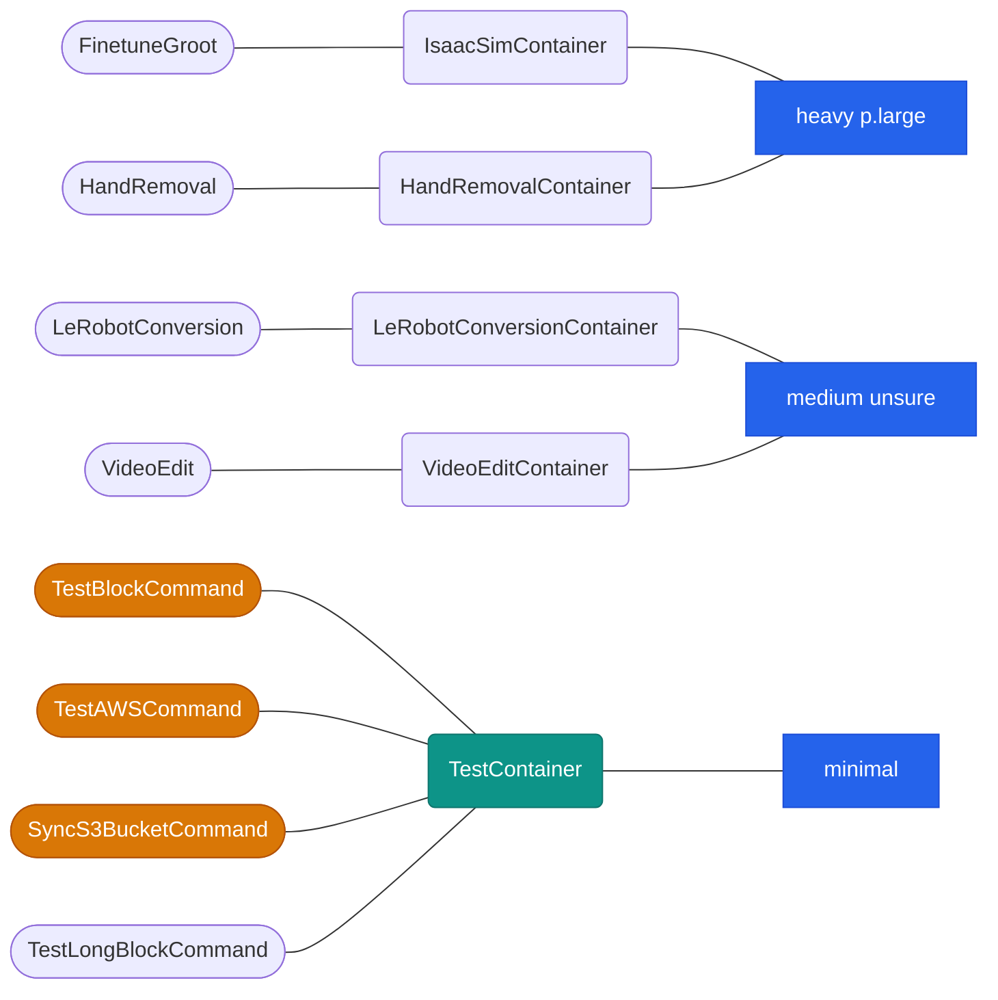

# Wave 1 Blocks


Local test doesn't mean much. I don't test these containers locally. I might test some of its software locally.

### This is how you build a container and push to AWS ECR.
```bash

aws ecr get-login-password --region us-east-2 | sudo docker login --username AWS --password-stdin 538091937392.dkr.ecr.us-east-2.amazonaws.com

REPO="blocks/<block_name>"
cd container
docker build -t $REPO . --no-cache
docker tag $REPO:latest 538091937392.dkr.ecr.us-east-2.amazonaws.com/$REPO:latest
docker push 538091937392.dkr.ecr.us-east-2.amazonaws.com/$REPO:latest
# To Test
sudo docker run --rm REPO:latest <command>
```